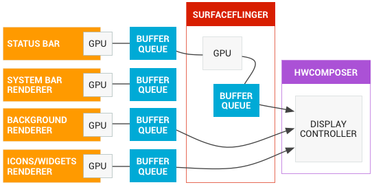

译自：https://source.android.com/devices/graphics/
 
<!-- toc -->

# 图形系统

Android 框架提供了用于2D和3D的各种图形渲染API，与制造商提供的图形驱动程序进行交互。因此很好地理解这些API在高级别上是如何工作是非常重要的。本节介绍了构建这些驱动程序的图形硬件抽象层（HAL）。

应用程序开发人员用两种方式将图像绘制到屏幕上：使用Canvas或OpenGL。有关Android图形组件的详细说明，请参阅图形系统架构 。

android.graphics.Canvas是一个2D图形API，是开发人员中最流行的图形API。 Canvas绘制了Android中所有的在库的和定制的android.view.View。在Android中，Canvas API的硬件加速是通过一个名为OpenGLRenderer的绘图库完成的，它将Canvas操作转换为OpenGL操作，以便它们可以在GPU上执行。

从Android 4.0开始，Canvas硬件加速是默认启用的。因此，支持OpenGL ES 2.0的GPU对于Android 4.0及更高版本的设备是必须要有的。有关硬件加速绘图的工作原理, 及其行为与软件绘图的差异的说明，请参阅[硬件加速指南](https://developer.android.com/guide/topics/graphics/hardware-accel.html) 。

除了Canvas，开发人员渲染图形的另一个主要方式是使用OpenGL ES直接渲染到Surface。Android在android.opengl包中提供了OpenGL ES接口，开发人员可以使用SDK调用其GL实现，或调用Android NDK中提供的原生API。

Android实现者可以使用[drawElements Quality Program](https://source.android.com/devices/graphics/testing.html)（也称为deqp）测试OpenGL ES功能。

## Android图形组件

无论开发人员用哪种渲染API，一切都是渲染到“surface”上。surface代表buffer queue的生产者侧，buffer queue通常由SurfaceFlinger消费。Android平台上创建的每个窗口后面都是由”surface“支撑。 所有可见的surface被SurfaceFlinger组合到显示器上。

下图显示了关键组件如何协同工作：

图1.surface是如何被渲染的

主要组件说明如下：

**图像流生产者**

图像生产者可以是能生成图形缓冲区以供消费的任何东西。示例中包括OpenGL ES，Canvas 2D和mediaserver视频解码器。

**图像流消费者**

最常见的图像流消费者是SurfaceFlinger，该系统服务消费了当前可见的surface，并利用Window Manager提供的信息将它们组合到显示屏上。SurfaceFlinger是唯一可以修改显示器内容的service。SurfaceFlinger使用OpenGL和Hardware Composer来组合一组surface。

其它OpenGL ES应用程序也可以消费图像流，例如相机应用程序消费相机预览图像流。非GL应用程序也可以是消费者，例如ImageReader类。

**Window Manager**
 
该Android系统服务控制了窗口，窗口是view的的容器。窗口总是由surface支撑。该service监控生命周期，输入和聚焦事件，屏幕方向，过渡，动画，位置，变换，z顺序，以及窗口的许多其他方面。Window Manager将所有的窗口元数据发送给SurfaceFlinger，SurfaceFlinger利用这些数据将surface组合到显示器。

**Hardware Composer**

Hardware Composer是显示子系统的硬件抽象。SurfaceFlinger可以将某些组合工作委派给Hardware Composer，以从OpenGL和GPU转移部分工作。SurfaceFlinger就像另一个OpenGL ES客户端。例如，当SurfaceFlinger积极地将一个缓冲区或两个缓冲区组合到第三个时，它使用的是OpenGL ES。Hardware Composer则使得比用GPU执行所有的组合计算的功耗更低。

Hardware Composer HAL 执行另一半的工作，是所有Android图形渲染的核心。Hardware Composer必须支持一些事件，其中之一是VSYNC（另一个是支持即插即用HDMI的热插拔）。

**Gralloc**

图形内存分配器（Gralloc），在图像生产者请求时，分配内存。有关详细信息，请参阅Gralloc HAL 。

## 数据流

有关Android图形管线的描述，请见下图：

图2.通过Android的图形数据流

左侧的对象是生产图形缓冲区的渲染器，如主屏幕，状态栏和系统UI。SurfaceFlinger是组合器，而Hardware Composer是组合者。

## BufferQueue

BufferQueues提供了Android图形组件之间的粘合。这些是一对队列，用于调节缓冲区从生产者到消费者的循环。一旦生产者移交他们的缓冲区，SurfaceFlinger负责将所有内容组合到显示器上。

BufferQueue的通信过程，请参阅的下图：

图3. BufferQueue通信过程

BufferQueue包含将图像流生产者和图像流消费者结合在一起的逻辑。图像生产者的一些例子是相机HAL生产的相机预览或OpenGL ES游戏。图像消费者的一些例子是SurfaceFlinger或一个显示OpenGL ES流的应用程序，例如显示相机取景器的相机应用程序。

BufferQueue是将缓冲区池与队列相结合的数据结构，并使用Binder IPC在进程之间传递缓冲区。 生产者接口，或传递给想要生产图形缓冲区的，是IGraphicBufferProducer（ SurfaceTexture的一部分）。BufferQueue经常被用于渲染到Surface，并被其他任务中的GL消费者所消费。BufferQueue可以在三种不同的模式下运行：

*同步模式* —— 默认情况下，BufferQueue以类似同步的模式运行，其中从生产者进来的每个缓冲区都被消费者消费。在此模式下，不会丢弃任何缓冲区。如果生产者太快，并且创建缓冲区比它们被排出的速度更快，它将阻塞并等待空闲的缓冲区。

*非阻塞模式* —— BufferQueue也可以在非阻塞模式下运行，在这种情况下，它不是等待缓冲区，而是产生错误，这种模式也不会丢弃缓冲区。对于由于可能不了解图形框架的复杂依赖性的而导致的应用软件的潜在死锁，这种方法可以避免。

*丢弃模式* —— 最后，BufferQueue可以被配置为丢弃旧缓冲区，而不是生成错误或等待。例如，如果尽可能快地将GL渲染到纹理视图和绘图，则必须删除缓冲区。

（译者注：下面两句话感觉是copy/paste的错误，和本小节没啥关系。）

为了进行大部分的工作，SurfaceFlinger只是另一个OpenGL ES客户。因此当SurfaceFlinger积极地将一个缓冲区或两个缓冲区组合到第三个时，它使用的是OpenGL ES。

Hardware Composer HAL进行了另一半的工作。该HAL作为所有Android图形渲染的中心点。

## 同步框架

由于Android图形系统不提供显式的并行处理，供应商很久以前就在他们自己的驱动程序中实现了自有的隐式同步。有了Android图形同步框架，这不再需要了。有关实现的说明，请参阅[显式同步](https://source.android.com/devices/graphics/implement-vsync.html#explicit_synchronization)部分。

同步框架明确地描述了系统中不同的异步操作之间的依赖关系。该框架提供了一个简单的API，让组件在释放缓冲区时发出信号。它还允许在驱动程序的内核空间到用户空间之间以及用户空间进程本身之间传递同步原语。

例如，应用程序可以排队在GPU上中执行的工作。然后，GPU开始绘制该图像。虽然图像尚未被绘制到内存中，但缓冲区指针仍然可以带着fence被传递到窗口组合器，该fence指示GPU何时完成工作。窗口组合器可以提前开始处理，并将工作移交给显示控制器。在这种方式下，CPU的工作可以提前完成。一旦GPU完成，显示控制器就可以立即显示图像。

同步框架还允许实现者在自己的硬件组件中利用同步资源。最后，框架提供了图形管线的可见性，以帮助调试。
