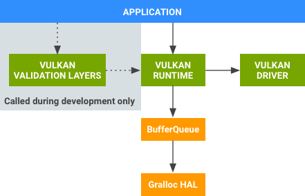

译自：https://source.android.com/devices/graphics/arch-vulkan
 
<!-- toc -->

# Vulkan

Android 7.0增加了对Vulkan的支持， Vulkan是用于高性能3D图形的低开销、跨平台的API。像OpenGL ES一样，Vulkan提供了应用程序创建高质量，实时图形的工具。Vulkan优势包括降低CPU开销并支持 [SPIR-V Binary Intermediate](https://www.khronos.org/spir) 语言。

片上系统（SoC） 供应商如GPU独立硬件供应商（IHV）可以为Android编写Vulkan驱动程序;  OEM只需要为特定设备集成这些驱动程序。有关Vulkan驱动程序如何与系统进行交互的详细信息，如何安装GPU特定工具，以及Android特定的要求，请参阅[Vulkan实现](https://source.android.com/devices/graphics/implement-vulkan.html)。

应用程序开发人员可以利用Vulkan来创建应用程序，应用程序在GPU上执行命令，能大大减少开销。 Vulkan还提供了当前图形硬件功能的更直观映射，能最大程度地减少驱动程序错误，并减少开发人员测试时间（比如用更少的时间来解决Vulkan错误）。

有关Vulkan的一般信息，请参阅[Vulkan概述](http://khr.io/vulkanlaunchoverview)或查看下面的资源列表。

## Vulkan组件

Vulkan的支持包括以下组件：

图1：Vulkan组件

* **Vulkan验证层** （ 在Android NDK中提供）。开发人员在开发Vulkan应用程序时使用的一组库。 来自图形供应商的Vulkan Runtime和Vulkan驱动程序不包含运行时错误检查，以确保Vulkan运行效率。 相反，用验证库（仅在开发过程中）来查找应用程序在使用Vulkan API过程中发生的错误。 在开发过程中 ，Vulkan验证库链接到应用程序中，并执行错误检查。在找到所有API使用的问题之后，应用程序不再需要包含这些库。

* **Vulkan Runtime** （由Android提供）。一个本地库(libvulkan.so），提供了一个名为Vulkan的新的公共API。它的大多数功能由GPU供应商提供的驱动程序实现; 该库封装了驱动程序，并提供API拦截功能（用于调试和其他开发工具），该库也管理驱动程序和平台依赖关系（如BufferQueue）之间的交互。

* **Vulkan 驱动程序**（由SoC提供）。将Vulkan API映射到特定于硬件的GPU命令，并和内核图形驱动程序交互。

## 修改了的组件

Android 7.0 修改了以下现有的图形组件以支持Vulkan：

* **BufferQueue** Vulkan Runtime通过已有的ANativeWindow接口与现有的BufferQueue组件进行交互。修改包括对ANativeWindow和BufferQueue的小修改（新枚举值和新方法），没有系统架构方面的修改。

* **Gralloc HAL** 包括了一个新的、可选的接口，用于发现一个给定格式是否可以用于特定的生产者/消费者组合，同时并不实际分配缓冲区。

有关这些组件的详细信息，请参阅 BufferQueue和gralloc （有关ANativeWindow详细信息，请参阅 EGLSurface和OpenGL ES）。

## Vulkan API

Android平台包括了来源于Khronos集团的[Vulkan API规范](https://www.khronos.org/vulkan/)中的[Android特定实现](https://developer.android.com/ndk/guides/graphics/index.html)。 Android应用程序必须使用[窗口系统集成（WSI）扩展](https://source.android.com/devices/graphics/implement-vulkan.html#wsi)以输出其渲染。

## 资源

有关Vulkan的更多信息，可通过以下资源了解：

* **[Vulkan Loader](https://android.googlesource.com/platform/frameworks/native/+/master/vulkan/#)** （libvulkan.so）在platform/frameworks/native/vulkan 。 包含了Android的Vulkan加载程序，以及一些适用于平台开发人员的和Vulkan有关的工具。

* **[Vulkan 实现指南](https://android.googlesource.com/platform/frameworks/native/+/master/vulkan/doc/implementors_guide/implementors_guide.html)** 旨在指导GPU IHV如何编写适用于Android的Vulkan驱动程序，以及OEM如何将这些驱动程序集成到特定设备。它描述了Vulkan驱动程序如何与系统进行交互，如何安装GPU特定工具，以及Android特定的要求。

* **[Vulkan Graphics API指南](https://developer.android.com/ndk/guides/graphics/index.html)** 包括有关在Android应用程序如何开始 使用Vulkan的信息，有关Android平台上Vulkan设计指南的详细信息，如何使用Vulkan的着色器编译器，以及如何使用验证层来确保使用Vulkan的应用程序的稳定性。

* **[Vulkan新闻](https://www.khronos.org/#slider_vulkan)** 涵盖事件，补丁，教程和更多Vulkan相关的新闻文章。
