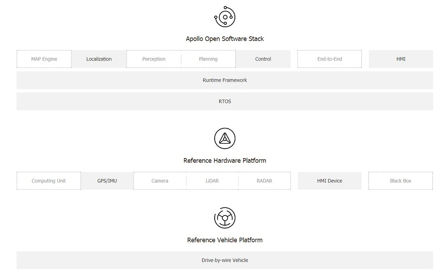
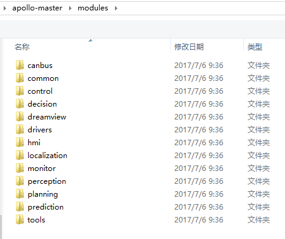

前不久，百度说要把自动驾驶平台apollo开源，要做自动驾驶平台的Android。现在，终于看到百度release的1.0版本的代码了。不过，核心的部分仍没有开源。百度说是会在年底之前开源。

开源使用的是apache 2.0 license，和Android一样。其它厂家使用这些代码不存在法律上的风险。

apollo开源的网址：
https://github.com/ApolloAuto

已经开源的部分，见下图实框部分，虚框部分都尚未开源。camera，lidar，radar，planning，perception什么的都尚未开源

# 自动驾驶平台硬件

[Apollo 1.0的硬件](https://github.com/ApolloAuto/apollo/blob/master/docs/quickstart/apollo_1_0_hardware_system_installation_guide.md)包括：

* **工控机**作为主计算系统 Onboard computer system ─ Neousys Nuvo-5095GC
 * Intel Skylake core i7-6700 CPU
 * 32GB DDR4 RAM
 * MezIO-V20-EP module (with ignition control for in-vehicle usage)
 * PO-160W-OW 160W AC/DC power adapter
 * CSM2 module (x16 PCIe expansion Gen3 8-lane cassette)
 * GPU卡拆了？？

* **CAN卡**用于控制汽车： Controller Area Network (CAN) Card ─ ESD CAN-PCIe/402-1

* **定位系统**：厘米级的定位精度 General Positioning System (GPS) and Inertial Measurement Unit (IMU)，两个选项:
 * NovAtel SPN-IGM-A1
 * NovAtel SPAN® ProPak6™ and NovAtel IMU-IGM-A1

# 自动驾驶平台软件
基于linux，不过apollo给linux打了realtime的patch，另外在其上面运行了ros（robot os），apollo也修改了ros。

现在开源代码分三部分：
* **apollo**：主要的代码，关键的代码在modules目录下：

不过核心的诸如decision，perception，planning，prediction都尚未开源。

* **apollo-kernel**：linux的patch，主要是realtime方面和一些驱动方面的修改。

* **apollo-platform**：ros的patch，主要的修改是去中心化，基于共享内存的通信，原生支持protobuf。

